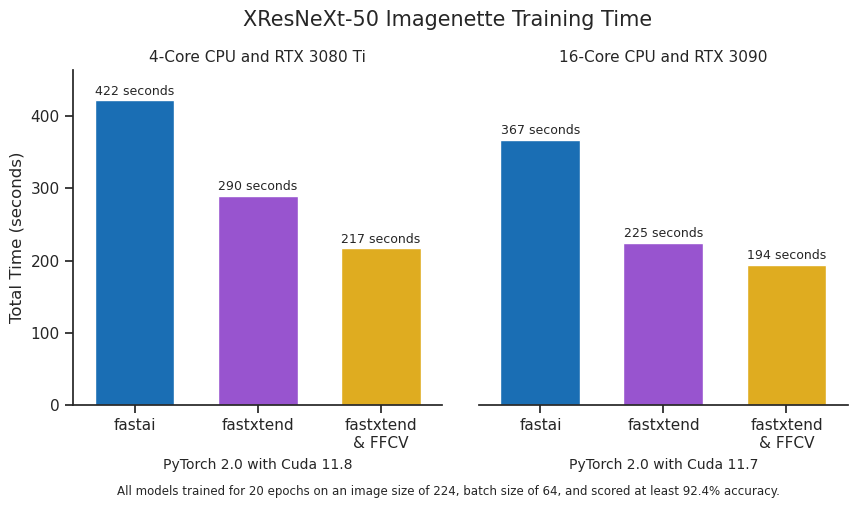

# fastxtend

<!-- WARNING: THIS FILE WAS AUTOGENERATED! DO NOT EDIT! -->

### Train fastai models faster (and other useful tools)



Train fastai models faster with fastxtend’s [fused
optimizers](optimizer.fused.html), [Progressive
Resizing](callback.progresize.html) callback, and integrated [FFCV
DataLoader](ffcv.tutorial.html).

## Feature overview

**Train Models Faster**

- Drop in [fused optimizers](optimizer.fused.html), which are 21 to 293
  percent faster then fastai native optimizers.
- Up to 75% optimizer memory savings with integrated
  [bitsandbytes](https://github.com/TimDettmers/bitsandbytes) [8-bit
  optimizers](optimizer.eightbit.html).
- Increase GPU throughput and decrease training time with the
  [Progressive Resizing](callback.progresize.html) callback.
- Use the highly optimized [FFCV DataLoader](ffcv.tutorial.html), fully
  integrated with fastai.
- Integrated support for `torch.compile` via the
  [Compile](callback.compiler.html) callbacks.

**General Features**

- Fused implementations of modern optimizers, such as
  [Adan](optimizer.adan.html), [Lion](optimizer.lion.html), &
  [StableAdam](optimizer.stableadam.html).
- Hugging Face [Transformers compatibility](text.huggingface.html) with
  fastai
- Flexible [metrics](metrics.html) which can log on train, valid, or
  both. Backwards compatible with fastai metrics.
- Easily use [multiple losses](multiloss.html) and log each individual
  loss on train and valid.
- [Multiple profilers](callback.profiler.html) for profiling training
  and identifying bottlenecks.
- A fast [Exponential Moving Average](callback.ema.html) callback for
  smoother training.

**Vision**

- Apply
  [`MixUp`](https://fastxtend.benjaminwarner.dev/callback.cutmixup.html#mixup),
  [`CutMix`](https://fastxtend.benjaminwarner.dev/callback.cutmixup.html#cutmix),
  or Augmentations at once with
  [`CutMixUp`](https://fastxtend.benjaminwarner.dev/callback.cutmixup.html#cutmixup)
  or
  [`CutMixUpAugment`](https://fastxtend.benjaminwarner.dev/callback.cutmixup.html#cutmixupaugment).
- Additional [image augmentations](vision.augment.batch.html).
- Support for running fastai [batch transforms on
  CPU](vision.data.html).
- More [attention](vision.models.attention_modules.html) and
  [pooling](vision.models.pooling.html) modules
- A flexible implementation of fastai’s
  [`XResNet`](https://fastxtend.benjaminwarner.dev/vision.models.xresnet.html#xresnet).

Check out the documentation for additional splitters, callbacks,
schedulers, utilities, and more.

## Documentation

<https://fastxtend.benjaminwarner.dev>

## Install

fastxtend is avalible on pypi:

``` bash
pip install fastxtend
```

fastxtend can be installed with task-specific dependencies for `vision`,
`ffcv`, `text`, `audio`, or `all`:

``` bash
pip install "fastxtend[all]"
```

To easily install most prerequisites for all fastxtend features, use
[Conda](https://docs.conda.io/en/latest) or
[Miniconda](https://docs.conda.io/en/latest/miniconda.html):

``` bash
conda create -n fastxtend python=3.11 "pytorch>=2.1" torchvision torchaudio \
pytorch-cuda=12.1 fastai nbdev pkg-config libjpeg-turbo opencv tqdm psutil \
terminaltables numpy "numba>=0.57" librosa timm kornia rich typer wandb \
"transformers>=4.34" "tokenizers>=0.14" "datasets>=2.14" ipykernel ipywidgets \
"matplotlib<3.8" -c pytorch -c nvidia -c fastai -c huggingface -c conda-forge

conda activate fastxtend

pip install "fastxtend[all]"
```

replacing `pytorch-cuda=12.1` with your preferred [supported version of
Cuda](https://pytorch.org/get-started/locally).

To create an editable development install:

``` bash
git clone https://github.com/warner-benjamin/fastxtend.git
cd fastxtend
pip install -e ".[dev]"
```

## Usage

Like fastai, fastxtend provides safe wildcard imports using python’s
`__all__`.

``` python
from fastai.vision.all import *
from fastxtend.vision.all import *
from fastxtend.ffcv.all import *
```

In general, import fastxtend after all fastai imports, as fastxtend
modifies fastai. Any method modified by fastxtend is backwards
compatible with the original fastai code.

## Examples

Use a fused ForEach optimizer:

``` python
Learner(..., opt_func=adam(foreach=True))
```

Or a bitsandbytes 8-bit optimizer:

``` python
Learner(..., opt_func=adam(eightbit=True))
```

Speed up image training using Progressive Resizing:

``` python
Learner(... cbs=ProgressiveResize())
```

Log an accuracy metric on the training set as a smoothed metric and
validation set like normal:

``` python
Learner(..., metrics=[Accuracy(log_metric=LogMetric.Train, metric_type=MetricType.Smooth),
                      Accuracy()])
```

Log multiple losses as individual metrics on train and valid:

``` python
mloss = MultiLoss(loss_funcs=[nn.MSELoss, nn.L1Loss],
                  weights=[1, 3.5], loss_names=['mse_loss', 'l1_loss'])

Learner(..., loss_func=mloss, metrics=RMSE(), cbs=MultiLossCallback)
```

Compile a model with `torch.compile`:

``` python
from fastxtend.callback import compiler

learn = Learner(...).compile()
```

Profile a fastai training loop:

``` python
from fastxtend.callback import simpleprofiler

learn = Learner(...).profile()
learn.fit_one_cycle(2, 3e-3)
```

## Benchmark

To run the benchmark on your own machine, see the [example
scripts](https://github.com/warner-benjamin/fastxtend/tree/main/examples)
for details on how to replicate.
