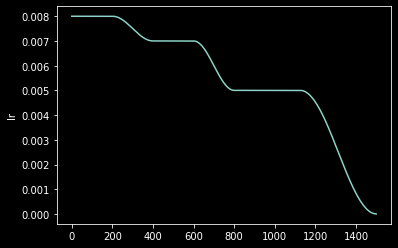
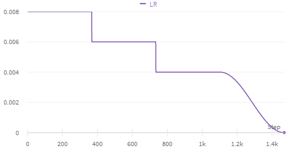

# fit_flat_varied

Fit `self.model` for `n_epoch` at flat `start_lr`, then change to flat `next_lr` at `change_by`, optionally with cosine annealing or custom `change_sched` over `change_time`. Final cosine annealing at `pct_start`.

Args:

`next_lr` single or list of learning rates to switch to at change_by. Must be same length as `change_by`.

`change_by` single or list of epochs or percent of steps to switch to `next_lr` by. Must be same length as `next_lr`.

`change_time` if greater than 0 (percent of steps or epochs), how long to cosine anneal to `next_lr`. Can be single or list of same length as `next_lr`.

`change_sched` optional single or list of fast.ai schedules. If `None` defaults to `SchedCos`. Must be same length as `next_lr`. `SchedPoly` must be passed as partial: `partial(SchedPoly, power=0.5)`.

## Example Schedules:

Discriminative Linear Warmup:

`learn.fit_flat_varied(4, slice(3e-5, 3e-3), next_lr=3e-3, change_by=1, change_time=1, change_sched=SchedLin)`

Multiple Cosine Annealing:

`learn.fit_flat_varied(15, 8e-3, next_lr=[6e-3, 4e-3], change_by=[4, 8], change_time=2)`

Immediate Change:

`learn.fit_flat_varied(10, 8e-3, next_lr=[6e-3, 4e-3], change_by=[0.25, 0.5], change_time=0)`

